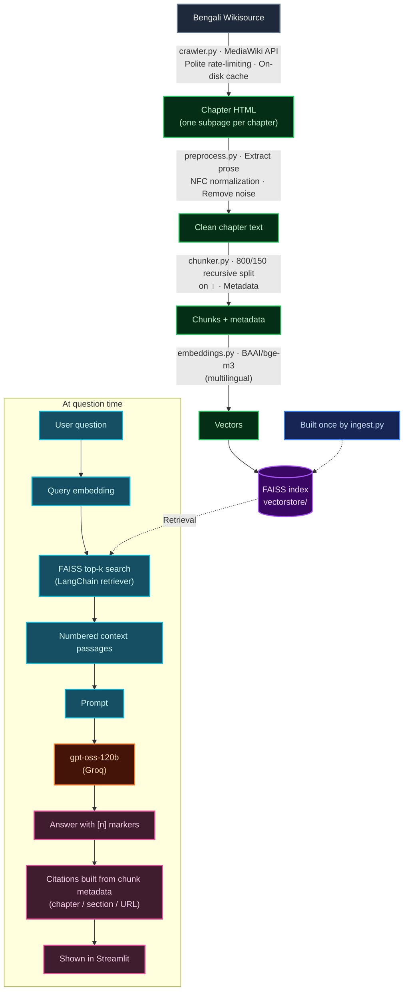

# 📖 দেবদাস (Devdas) — Bengali Literature RAG Chatbot

A Retrieval-Augmented Generation (RAG) chatbot that lets users ask questions about the Bengali novel **দেবদাস (Devdas)** by Sarat Chandra Chattopadhyay.

The chatbot retrieves relevant passages from the original book, generates answers grounded in those passages, and provides chapter, section, and source URL citations. If the retrieved text does not contain the answer, it clearly says so instead of making one up.

## 🎬 Demo Video

<p align="center">
  <a href="https://drive.google.com/file/d/13qp1dw6-GsZ0FwHbNQwcM1KCNz8Nbr2E/view?usp=sharing">
    
  </a>
</p>

---

## 1. Book Information

| Field | Details |
|---|---|
| **Book title** | দেবদাস (Devdas) |
| **Author** | শরৎচন্দ্র চট্টোপাধ্যায় (Sarat Chandra Chattopadhyay) |
| **First published** | 1917 |
| **Source** | [Bengali Wikisource](https://bn.wikisource.org/wiki/%E0%A6%A6%E0%A7%87%E0%A6%AC%E0%A6%A6%E0%A6%BE%E0%A6%B8_(%E0%A6%B6%E0%A6%B0%E0%A7%8E%E0%A6%9A%E0%A6%A8%E0%A7%8D%E0%A6%A6%E0%A7%8D%E0%A6%B0_%E0%A6%9A%E0%A6%9F%E0%A7%8D%E0%A6%9F%E0%A7%8B%E0%A6%AA%E0%A6%BE%E0%A6%A7%E0%A7%8D%E0%A6%AF%E0%A6%BE%E0%A6%AF%E0%A6%BC) |
| **Book structure** | Main page + one subpage per chapter, from প্রথম পরিচ্ছেদ to ষোড়শ পরিচ্ছেদ |

### About the novel

*Devdas* is a tragic love story set in rural Bengal. Devdas, the son of a zamindar, and his childhood companion Parbati (Paro) grow up together in the village of Talsonapur.

When family pride and social conventions keep them apart, Paro is married to an older zamindar. Devdas, consumed by guilt and self-destruction, turns to alcohol and drifts through Calcutta, where he encounters the courtesan Chandramukhi. The story ultimately ends in tragedy.

This project makes the novel searchable through natural-language questions while keeping generated answers connected to the original Bengali text.

---

## 2. Project Structure

```text
├── app.py               # Streamlit chat interface
├── rag.py               # RAG pipeline (LangChain retriever + Groq LLM, citations, no-answer)
├── ingest.py            # crawl -> clean -> chunk -> embed -> FAISS (run once)
├── crawler.py           # rate-limit-friendly Wikisource crawler (MediaWiki API)
├── preprocess.py        # HTML -> text, Unicode/whitespace cleaning
├── chunker.py           # chunking + metadata
├── embeddings.py        # multilingual embedding model factory
├── vectorstore.py       # FAISS build / load helpers
├── evaluate.py          # test-question tools, hit-rate, bonus comparison
├── config.py            # all settings (overridable via .env)
├── test_questions.json  # 10 test questions + expected answers (machine-readable)
├── TEST_QUESTIONS.md    # the same 10 questions as a table
├── DEMO_SCRIPT.md       # script for the 3–5 minute demo video
├── requirements.txt
└── .env.example
```

---

## 3. Setup and Running Instructions

### Prerequisites

- **Python:** 3.10–3.12 (64-bit)
- **Disk space:** Approximately 3 GB for PyTorch and the embedding model
- **API key:** A free [Groq API key](https://console.groq.com/keys). No credit card is required.

### Installation

**1. Clone the repository**

```bash
git clone https://github.com/MehdiHossenFahim/devdas-rag
cd devdas-rag
```

**2. Create and activate a virtual environment**

```bash
python -m venv .venv

# Linux / macOS
source .venv/bin/activate

# Windows
.venv\Scripts\activate
```

**3. Install dependencies**

```bash
pip install -r requirements.txt
```

**4. Configure environment variables**

```bash
# Linux / macOS
cp .env.example .env

# Windows
copy .env.example .env
```

Open `.env` and add your `GROQ_API_KEY`. Also, provide your email address in `USER_AGENT` for the Wikisource crawler.

**5. Build the knowledge base**

```bash
python ingest.py
```

This runs the ingestion pipeline: crawl, preprocess, chunk, embed, and build the FAISS index. You only need to do this once for the initial setup.

**6. Start the chatbot**

```bash
streamlit run app.py
```

Streamlit will open the application at:

```text
http://localhost:8501
```

### A few things to know

- On first use, the embedding model (`BAAI/bge-m3`) downloads approximately 2.3 GB. Embedding a few hundred chunks may take a few minutes on CPU.
- If you're working on a machine with limited resources, set the following in `.env` **before running ingestion**:

  ```env
  EMBEDDING_MODEL=intfloat/multilingual-e5-base
  ```

  This model is approximately half the size.

- Crawled pages are cached in `data/raw/`. Re-running `ingest.py` reuses the cache instead of requesting every page from Wikisource again.
- To force a fresh crawl:

  ```bash
  python ingest.py --refresh
  ```

- To reuse the previously downloaded chapter data without crawling:

  ```bash
  python ingest.py --skip-crawl
  ```

- You can also test the RAG pipeline directly from the terminal without opening Streamlit:

  ```bash
  python rag.py "চন্দ্রমুখী কে?"
  ```

---

## 4. Technical Details

| Component | Implementation |
|---|---|
| **Embedding model** | `BAAI/bge-m3` via sentence-transformers, 1024-dimensional normalized vectors |
| **Chunk size** | 800 characters |
| **Chunk overlap** | 150 characters (~19%) |
| **Text splitter** | LangChain `RecursiveCharacterTextSplitter` |
| **Separators** | `\n\n`, `\n`, `।`, `?`, `!`, space |
| **Vector database** | FAISS (`faiss-cpu`) via `langchain_community.vectorstores.FAISS` |
| **Index persistence** | `vectorstore/` |
| **Retriever** | `vectorstore.as_retriever(search_type="similarity", search_kwargs={"k": 5})` |
| **LLM** | `openai/gpt-oss-120b` hosted on Groq |
| **LLM integration** | `langchain-groq` |
| **Temperature** | `0` |
| **Reasoning effort** | `low` |
| **Frontend** | Streamlit chat UI |

### 4.1. Embedding Model: Why BAAI/bge-m3?

`BAAI/bge-m3` is a multilingual embedding model built on an XLM-RoBERTa-large backbone. It supports more than 100 languages, including Bengali, and its retrieval training and evaluation include the multilingual MIRACL benchmark, which has a Bengali subset.

It was selected for this project for several reasons.

**Bengali language support**

The XLM-R vocabulary covers Bengali script, allowing Bengali words, conjuncts (যুক্তাক্ষর), and inflections to be tokenized meaningfully rather than being fragmented as they might be with English-only models.

**Designed for retrieval**

The model is trained for query-to-passage retrieval, which fits this project's use case: matching a short Bengali question to a relevant passage from literary Bengali prose.

It can also handle differences between the older *sadhu bhasha* used by Sarat Chandra (such as "করিয়া" and "কহিল") and the modern *cholito* wording users may type (such as "করে" and "বলল").

**Long context window**

The model supports an 8192-token context window. This project caps the embedding input at 512 tokens for speed, which is comfortably above the typical length of an 800-character chunk.

**No required prompt prefixes**

Unlike multilingual-e5 models, BGE-M3 does not require `query:` or `passage:` prefixes. The `embeddings.py` module adds those automatically when switching to a multilingual-e5 model.

**Free and locally runnable**

The model is open-source and runs locally. No embedding API key or credit card is needed.

#### Why not `paraphrase-multilingual-MiniLM`?

It is fast, but it is trained on approximately 50 languages, with Bengali not among them, and is tuned for sentence similarity rather than retrieval.

---

### 4.2. Preprocessing (`crawler.py`, `preprocess.py`)

The raw Wikisource pages are cleaned before chunking and embedding.

1. **HTML extraction** — Extract paragraph-level text from the rendered page. Tables, the Wikisource header template, page-number markers, footnote references, edit links, navigation boxes, scripts, and styles are removed.

2. **Unicode NFC normalization** — Bengali characters such as `য়`, `ড়`, and `ঢ়`, along with vowel signs, can be stored in composed or decomposed forms. NFC normalization makes equivalent text representations consistent. The same normalization is applied to user questions.

3. **Invisible-character removal** — Remove zero-width spaces, BOM, soft hyphens, and directional marks. ZWJ and ZWNJ are preserved because they can affect how Bengali conjuncts render.

4. **Whitespace cleanup** — Collapse spaces and tabs, trim lines, and reduce three or more consecutive blank lines to a single blank line.

5. **Header and page-number cleanup** — Remove page-number residue such as `১০০-১১০` and repeated headers containing `দেবদাস / শরৎচন্দ্র চট্টোপাধ্যায় / <chapter>`.

6. **Paragraph preservation** — Paragraph boundaries are retained so the text splitter can use them when creating chunks.

---

### 4.3. Chunking Strategy

The current configuration uses **800-character chunks with 150-character overlap**.

#### Why 800 / 150?

Bengali is character-dense, so 800 characters typically represent around 120–150 words. This is usually enough for one or two paragraphs, or a short scene of dialogue.

The goal is to preserve enough context to capture a complete event, such as who introduced Devdas to Chandramukhi, while keeping each embedding focused on a relatively small topic.

Smaller, focused passages also help limit the amount of context sent to the LLM, which matters when working within Groq's free-tier token limits.

#### Overlap

The 150-character overlap helps preserve sentences or dialogue that cross chunk boundaries, increasing the chance that at least one chunk contains the complete passage.

#### Bengali-aware splitting

The splitter follows this separator hierarchy:

1. Paragraph (`\n\n`)
2. Line (`\n`)
3. Sentence endings (`।`, `?`, `!`)
4. Word boundaries (space)

This helps chunks begin and end at natural boundaries, with the Bengali danda (`।`) kept attached to the sentence it ends whenever possible.

#### Metadata stored with every chunk

Each chunk includes:

| Metadata field | Purpose |
|---|---|
| `book` | Book identifier |
| `chapter` | Chapter title |
| `chapter_no` | Chapter number |
| `section` | Chunk's position within its chapter |
| `source` | Wikisource URL of the chapter |
| `chunk_index` | Chunk index |
| `chunks_in_chapter` | Total chunks in that chapter |
| `start_index` | Character offset within the chapter |
| `chunk_id` | Unique chunk identifier |

For example, a section may look like `সপ্তম পরিচ্ছেদ — অংশ 3/9`.

The novel does not contain subheadings within chapters, so `section` represents the chunk's position within its chapter.

Alternative chunking configurations were evaluated using a hit-rate test. See [Section 8: Comparing Approaches](#8-comparing-approaches-hit-rate).

---

### 4.4. Retriever Configuration

The chatbot uses plain top-k similarity search with `k = 5`.

```python
vectorstore.as_retriever(
    search_type="similarity",
    search_kwargs={"k": 5}
)
```

The value of `k` can be configured through `TOP_K` or adjusted using the slider in the Streamlit UI.

The vectors are L2-normalized, making FAISS's L2-distance ranking equivalent to cosine-similarity ranking for these vectors.

---

## 5. RAG Pipeline

The pipeline has two stages: building the knowledge base once and retrieving relevant passages whenever a user asks a question.



### LangChain Expression Language (LCEL)

The RAG chain is implemented in `rag.py` using LangChain Expression Language:

```python
RunnableParallel(question=RunnablePassthrough(), docs=retriever)
  | RunnablePassthrough.assign(context=format_docs)
  | RunnablePassthrough.assign(raw_answer=PROMPT | llm | StrOutputParser())
```

The chain retrieves relevant documents, formats them into context, and passes the context and prompt to the LLM. The generated answer is then processed alongside the retrieved chunk metadata to build source citations.

### How the "answer only from the book, with citations" rule works

The chatbot uses several safeguards to keep its answers grounded in the source text.

1. **Grounded prompt** — The LLM receives only the numbered retrieved passages and is instructed not to use outside knowledge, including its own knowledge of the novel or its film adaptations. It must answer in the language of the question and cite `[n]` after each statement.

2. **Explicit no-answer path** — If the retrieved passages do not contain the answer, the model must return the sentinel `NOT_IN_BOOK`. The app then displays:

   > দুঃখিত, এই প্রশ্নের উত্তর “দেবদাস” বইয়ে পাওয়া যায়নি।

   The English sentence is displayed alongside it, and no fabricated sources are listed.

3. **Citations are built in code, not generated by the LLM** — The model indicates which passage number it used. `rag.py` maps that number back to the retrieved chunk and obtains the actual chapter, section, and Wikisource URL from its metadata. The app also displays the passage text so users can verify the answer.

4. **Deterministic generation settings** — `temperature = 0` is used to encourage consistent, conservative answers.

5. **Consistent Unicode normalization** — User questions undergo the same NFC normalization as the book text.

---

### Crawler and Wikisource Rate Limiting (`crawler.py`)

The crawler is designed to be polite to Wikisource and resume safely if interrupted.

- **MediaWiki API:** Uses `action=parse` to retrieve chapter HTML and `list=allpages` for page discovery instead of repeatedly requesting rendered HTML pages.
- **Complete chapter discovery:** Reads the main page's table of contents and the `allpages` API results to find chapter subpages while preserving their reading order.
- **Sequential requests:** Makes one request at a time, with a minimum delay of `REQUEST_DELAY` seconds (default: 2 seconds) plus random jitter.
- **Wikimedia `maxlag`:** Includes the recommended `maxlag` parameter.
- **Retry handling:** On HTTP 429 or 5xx responses, respects `Retry-After` when available. Otherwise, it uses exponential backoff (5 s, 10 s, 20 s, and so on), up to `MAX_RETRIES`.
- **Descriptive User-Agent:** Uses a descriptive `User-Agent` string. Add your email address in `.env`.
- **On-disk caching:** Every page is cached in `data/raw/`. If a crawl is interrupted, it can resume where it stopped. Later runs reuse cached pages without making requests for them again.

---

## 6. Groq Free-Tier Notes

The project uses Groq's free tier, which does not require a credit card but is subject to request and token limits per minute and per day.

- [Groq rate limits](https://console.groq.com/docs/rate-limits)
- [Your Groq account limits](https://console.groq.com/settings/limits)

The chatbot is configured to reduce unnecessary token usage:

- Small retrieval context (`k = 5` chunks of approximately 800 characters each)
- `reasoning_effort = low`
- `temperature = 0`
- Automatic retries by the Groq SDK on HTTP 429 responses

If you encounter a rate-limit error, wait a minute before retrying.

When running the full QA evaluation, questions are spaced 20 seconds apart by default. You can adjust this using `--qa-delay`.

```bash
python evaluate.py --qa --qa-delay 20
```

If `openai/gpt-oss-120b` becomes unavailable on your account, set `GROQ_MODEL` in `.env` to another model hosted by Groq.

---

## 7. Test Questions and Evaluation

The project includes 10 test questions:

- 8 questions that are answerable from the book
- 2 questions whose answers are not in the book

Expected answers and source chapters are documented in:

- [`TEST_QUESTIONS.md`](TEST_QUESTIONS.md)
- [`test_questions.json`](test_questions.json)

### Available evaluation commands

**Locate evidence for each test question**

```bash
python evaluate.py --locate --write
```

This finds which chapters contain each question's evidence keywords and fills the `Source / Chapter` column.

**Evaluate retrieval performance**

```bash
python evaluate.py --retrieval
```

Calculates Hit@1, Hit@3, and Hit@5 for the current FAISS index without calling the LLM.

**Run the full chatbot evaluation**

```bash
python evaluate.py --qa
```

Runs all 10 questions through the full chatbot and writes the results to:

```text
results/qa_results.md
```

---

## 8. Comparing Approaches (Hit Rate)

This project compares different chunking configurations and embedding models to understand how they affect retrieval quality for Bengali literary text.

### What was tested?

**Chunking strategies**

- `400/80` — 400-character chunks with 80-character overlap
- `800/150` — 800-character chunks with 150-character overlap
- `1200/200` — 1200-character chunks with 200-character overlap

**Embedding models**

- `BAAI/bge-m3`
- `intfloat/multilingual-e5-base`

### Evaluation methodology

For each answerable test question:

1. Embed the question using the embedding model under evaluation.
2. Retrieve the top-k chunks from the FAISS index built with the configuration being tested.
3. Count a hit if any of the top-k chunks comes from the expected chapter **and** contains at least one of the question's evidence keywords. This is determined by `evaluate.py::is_hit`.

The hit rate is calculated as:

`Hit rate@k = hits / answerable questions`

No LLM is involved in this evaluation. It measures retrieval performance alone, rather than the quality of generated answers.

### Run the comparisons

**Compare chunking configurations**

```bash
python evaluate.py --compare-chunking 400:80 800:150 1200:200
```

**Compare embedding models**

```bash
python evaluate.py --compare-embeddings BAAI/bge-m3 intfloat/multilingual-e5-base
```

### Results

The table below records the current baseline and leaves unrun comparisons marked as `Pending`. Update the pending values after running the corresponding evaluation commands.

| Approach | Hit@1 | Hit@3 | Hit@5 |
|---|---:|---:|---:|
| Chunk 400 / 80 | Pending | Pending | Pending |
| Chunk 800 / 150 | 12% | 38% | 50% |
| Chunk 1200 / 200 | Pending | Pending | Pending |
| BAAI/bge-m3 | 12% | 38% | 50% |
| multilingual-e5-base | Pending | Pending | Pending |

**Note:** The `BAAI/bge-m3` row represents the baseline embedding configuration using 800 / 150 chunking. The embedding comparison should be run under the same evaluation setup before drawing conclusions about the relative performance of the two models.

---

## 9. Conclusion

This project explores how Retrieval-Augmented Generation can make Bengali literature more accessible through natural-language question answering.

Using *Devdas* by Sarat Chandra Chattopadhyay as its knowledge source, the system combines Bengali text preprocessing, recursive chunking, multilingual embeddings, FAISS similarity search, LangChain, and Groq's gpt-oss-120b to retrieve relevant passages and generate answers grounded in the original novel.

Source-based citations, including chapter, section, and Wikisource URL metadata, allow users to trace generated answers back to the text. The explicit no-answer mechanism also helps the chatbot avoid presenting unsupported information when the retrieved passages do not contain an answer.

Beyond building a functional Bengali literary chatbot, this project provides an opportunity to explore the challenges of multilingual retrieval, especially with literary Bengali that differs from modern conversational language.

Future improvements could include better Bengali retrieval accuracy, more comprehensive evaluation, improved handling of paraphrased questions, and support for additional Bengali literary works.

---

## Author

**Mehedi Hossen Fahim**

- GitHub: [@MehdiHossenFahim](https://github.com/MehdiHossenFahim)
