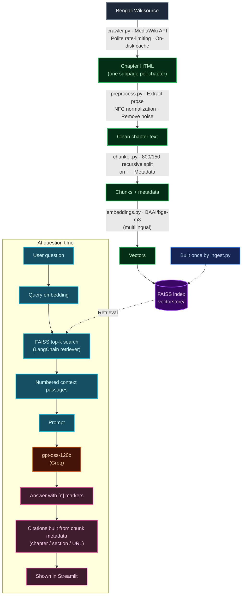

# 📖 দেবদাস — Knowledge Base Chatbot (RAG + FAISS)

## Demo Video Link

<p align="center">
  <a href="https://drive.google.com/file/d/13qp1dw6-GsZ0FwHbNQwcM1KCNz8Nbr2E/view?usp=sharing">
    
  </a>
</p>

A Retrieval-Augmented-Generation chatbot that answers questions about the Bengali novel
**দেবদাস** using _only_ the text of the book, cites the chapter/section it used, and says so
clearly when the answer is not in the book.

## 1. Book Information

|                             |                                                                                                                                                                                                                                                                                                   |
| --------------------------- | ------------------------------------------------------------------------------------------------------------------------------------------------------------------------------------------------------------------------------------------------------------------------------------------------- |
| **Book title**              | দেবদাস (Devdas)                                                                                                                                                                                                                                                                                   |
| **Author**                  | শরৎচন্দ্র চট্টোপাধ্যায় (Sarat Chandra Chattopadhyay)                                                                                                                                                                                                                                             |
| **Bengali Wikisource link** | <https://bn.wikisource.org/wiki/%E0%A6%A6%E0%A7%87%E0%A6%AC%E0%A6%A6%E0%A6%BE%E0%A6%B8_(%E0%A6%B6%E0%A6%B0%E0%A7%8E%E0%A6%9A%E0%A6%A8%E0%A7%8D%E0%A6%A6%E0%A7%8D%E0%A6%B0_%E0%A6%9A%E0%A6%9F%E0%A7%8D%E0%A6%9F%E0%A7%8B%E0%A6%AA%E0%A6%BE%E0%A6%A7%E0%A7%8D%E0%A6%AF%E0%A6%BE%E0%A6%AF%E0%A6%BC)> |
| **Structure on Wikisource** | main page + one subpage per chapter (`…/প্রথম পরিচ্ছেদ` … `…/ষোড়শ পরিচ্ছেদ`)                                                                                                                                                                                                                     |

**Description.** _Devdas_ (first published 1917) is a tragic love story set in rural Bengal.
Devdas, the son of a zamindar, and his childhood companion Parbati (Paro) grow up together in
the village of Talsonapur. When family pride and social convention keep them apart, Paro is
married to an older zamindar, and Devdas — lost in guilt, alcohol and self-destruction — drifts
through Calcutta, where he meets the courtesan Chandramukhi, before his tragic end.

## 2. Project structure

```
├── app.py               # Streamlit chat interface
├── rag.py               # RAG pipeline (LangChain retriever + Groq LLM, citations, no-answer)
├── ingest.py            # crawl -> clean -> chunk -> embed -> FAISS  (run once)
├── crawler.py           # rate-limit-friendly Wikisource crawler (MediaWiki API)
├── preprocess.py        # HTML -> text, Unicode/whitespace cleaning
├── chunker.py           # chunking + metadata
├── embeddings.py        # multilingual embedding model factory
├── vectorstore.py       # FAISS build / load helpers
├── evaluate.py          # test-question tools, hit-rate, bonus comparison
├── config.py            # all settings (overridable via .env)
├── test_questions.json  # 10 test questions + expected answers (machine-readable)
├── TEST_QUESTIONS.md    # the same 10 questions as a table
├── DEMO_SCRIPT.md       # script for the 3–5 minute demo video
├── requirements.txt
└── .env.example
```

## 3. Setup & running instructions

**Python:** 3.10 – 3.12 (64-bit). **Disk:** ~3 GB (PyTorch + the embedding model).
**Accounts:** a free [Groq](https://console.groq.com/keys) API key — no credit card needed.

```bash
# 1. clone + enter the project
git clone https://github.com/MehdiHossenFahim/devdas-rag && cd devdas-rag

# 2. virtual environment
python -m venv .venv
source .venv/bin/activate          # Windows: .venv\Scripts\activate

# 3. install dependencies
pip install -r requirements.txt

# 4. configuration
cp .env.example .env               # Windows: copy .env.example .env
#    -> open .env, paste your GROQ_API_KEY and put your e-mail in USER_AGENT

# 5. build the knowledge base (crawl + clean + chunk + embed + FAISS). One time.
python ingest.py

# 6. start the chatbot
streamlit run app.py               # opens http://localhost:8501
```

Notes

- Step 5 downloads the embedding model (~2.3 GB for `BAAI/bge-m3`) on first use and embeds a few
  hundred chunks; expect a few minutes on CPU. On a weak machine set
  `EMBEDDING_MODEL=intfloat/multilingual-e5-base` in `.env` (about half the size) **before** step 5.
- The crawl is cached in `data/raw/`; re-running `ingest.py` does not hit Wikisource again
  (use `python ingest.py --refresh` to force it). `python ingest.py --skip-crawl` reuses
  `data/chapters.jsonl`.
- Quick CLI check without the UI: `python rag.py "চন্দ্রমুখী কে?"`.

## 4. Technical details

| Item                | Choice                                                                                                |
| ------------------- | ----------------------------------------------------------------------------------------------------- |
| **Embedding model** | `BAAI/bge-m3` (sentence-transformers, 1024-dim, normalised)                                           |
| **Chunk size**      | 800 characters                                                                                        |
| **Chunk overlap**   | 150 characters (~19 %)                                                                                |
| **Splitter**        | LangChain `RecursiveCharacterTextSplitter`, separators `\n\n`, `\n`, `।`, `?`, `!`, space             |
| **Vector database** | FAISS (`faiss-cpu`) via `langchain_community.vectorstores.FAISS`, persisted in `vectorstore/`         |
| **Retriever**       | LangChain `vectorstore.as_retriever(search_type="similarity", search_kwargs={"k": 5})`                |
| **LLM**             | `openai/gpt-oss-120b` on Groq's free tier (`langchain-groq`), `temperature=0`, `reasoning_effort=low` |
| **Frontend**        | Streamlit chat UI                                                                                     |

### 4.1 Embedding model — what, why, and how it handles Bengali

**BAAI/bge-m3** is a multilingual embedding model built on an XLM-RoBERTa-large backbone and
trained on data covering 100+ languages, including Bengali (its retrieval training and evaluation
include the multilingual MIRACL benchmark, which has a Bengali subset). Reasons for choosing it:

- **Bengali support.** The subword vocabulary of XLM-R covers the Bengali script, so words,
  conjuncts (যুক্তাক্ষর) and inflections are tokenised sensibly instead of being shattered into
  bytes — which is what happens with English-only models.
- **Retrieval-oriented.** It is trained for query→passage retrieval, exactly our use case
  (short Bengali question → passage of literary Bengali prose). It also copes reasonably with the
  old-style _sadhu bhasha_ used by Sarat Chandra (e.g. "করিয়া", "কহিল") vs. the modern
  _cholito_ wording users typically type ("করে", "বলল").
- **Long context.** 8192-token window, so our chunks are never truncated (we cap it at 512
  tokens for speed; an 800-character chunk is far below that).
- **No prompt prefixes needed**, unlike e5 models (`query:` / `passage:`) — although
  `embeddings.py` adds those automatically if you switch to a multilingual-e5 model.
- Free, open-source and runs locally: no API key, no credit card.

_Why not `paraphrase-multilingual-MiniLM`?_ It is fast, but it is trained on ~50 languages and
Bengali is not among them, and it is tuned for sentence similarity rather than retrieval.

### 4.2 Preprocessing (`crawler.py`, `preprocess.py`)

1. **HTML extraction** — take only the paragraph-level text of the rendered page. Removed:
   tables, the Wikisource header template, page-number markers, footnote references, edit links,
   navigation boxes, scripts/styles.
2. **Unicode NFC normalisation** — Bengali letters such as `য়`/`ড়`/`ঢ়` and vowel signs can be
   stored in composed or decomposed form; NFC makes identical words compare equal (the same
   normalisation is applied to user questions).
3. **Invisible-character removal** — zero-width space, BOM, soft hyphen, directional marks.
   ZWJ/ZWNJ are _kept_ because they change how Bengali conjuncts render.
4. **Whitespace tidy-up** — collapse spaces/tabs, trim lines, collapse 3+ blank lines to one blank line.
5. **Header/page-number residue removal** — lines such as `১০০-১১০` or a repeated
   "দেবদাস / শরৎচন্দ্র চট্টোপাধ্যায় / <chapter>" header are dropped.
6. Paragraph boundaries are preserved so the splitter can respect them.

### 4.3 Chunking

- **800 characters, 150 overlap.** Bengali is character-dense: 800 characters is roughly
  120–150 words — one or two paragraphs of the novel, or a short scene of dialogue. That is big
  enough to hold a complete event ("who introduced Devdas to Chandramukhi?") yet small enough that
  the embedding stays focused on one topic and only a few passages need to be sent to the LLM
  (important for Groq's free tokens-per-minute limit).
- **150-character overlap** keeps a sentence/speech that straddles a boundary intact in at least
  one chunk.
- **Bengali-aware separators**: paragraph → line → sentence end (`।`, `?`, `!`) → word. Chunks
  therefore normally start and end on sentence boundaries, and the danda stays attached to the
  sentence it ends.
- **Metadata on every chunk**: `book`, `chapter`, `chapter_no`, `section`
  (e.g. `সপ্তম পরিচ্ছেদ — অংশ 3/9`), `source` (Wikisource URL of that chapter), `chunk_index`,
  `chunks_in_chapter`, `start_index` (character offset in the chapter), `chunk_id`.
  _(This novel has no sub-headings inside a chapter, so "section" = the chunk's position within
  its chapter.)_

The alternatives were compared with a hit-rate test — see §8 (bonus).

### 4.4 Retriever configuration

Plain top-k **similarity search** (`k = 5`, configurable with `TOP_K` or the slider in the UI).
Vectors are L2-normalised, so FAISS's L2 ranking is identical to cosine-similarity ranking.

## 5. RAG pipeline



The chain is written with LangChain Expression Language in `rag.py`:

```python
RunnableParallel(question=RunnablePassthrough(), docs=retriever)
  | RunnablePassthrough.assign(context=format_docs)
  | RunnablePassthrough.assign(raw_answer=PROMPT | llm | StrOutputParser())
```

### How the "answer only from the book, with citations" rule is enforced

1. **Grounded prompt** – the LLM sees only the numbered retrieved passages and is told to use
   nothing else (not even its own knowledge of the novel or its film adaptations), to answer in the
   language of the question, and to cite `[n]` after each statement.
2. **Explicit no-answer path** – if the passages don't contain the answer, the model must output
   the sentinel `NOT_IN_BOOK`; the app then shows _"দুঃখিত, এই প্রশ্নের উত্তর “দেবদাস” বইয়ে পাওয়া
   যায়নি।"_ together with the English sentence, and lists no fake sources.
3. **Citations come from code, not from the LLM.** The model only says _which passage number_ it
   used; `rag.py` maps that number back to the retrieved chunk and prints the real chapter, section
   and Wikisource URL from its metadata, plus the passage text, so the user can verify every claim.
4. `temperature = 0` for deterministic, conservative answers.
5. The same Unicode normalisation is applied to the question as to the book.

### Crawler & Wikisource rate limiting (`crawler.py`)

- Uses the MediaWiki **API** (`action=parse` for chapter HTML, `list=allpages` for discovery)
  rather than hammering the HTML site; page lists are read from the main page's table of contents
  _and_ from `allpages`, so every subpage is found and chapters keep their reading order.
- One request at a time, with a minimum delay of `REQUEST_DELAY` seconds (default 2 s) plus random
  jitter, and Wikimedia's recommended `maxlag` parameter.
- On HTTP 429/5xx it honours `Retry-After`, otherwise backs off exponentially (5 s, 10 s, 20 s …,
  up to `MAX_RETRIES`).
- Descriptive `User-Agent` (set your e-mail in `.env`).
- Every page is cached in `data/raw/`, so an interrupted crawl resumes where it stopped and later
  runs make no requests for cached pages.

## 6. Groq free-tier notes

The free tier needs no credit card but is rate-limited (requests _and_ tokens per minute/day — see
<https://console.groq.com/docs/rate-limits> and your own limits at
<https://console.groq.com/settings/limits>). The app is built to stay within it: small context
(`k = 5` chunks of ~800 characters), `reasoning_effort=low`, `temperature=0`, and the Groq SDK
retries automatically on HTTP 429. If you still see a rate-limit error, wait a minute; when
running `python evaluate.py --qa` questions are spaced 20 s apart by default (`--qa-delay`).
If `openai/gpt-oss-120b` is ever unavailable on your account, set `GROQ_MODEL` in `.env` to another
Groq-hosted model.

## 7. Test questions

Ten questions (8 answerable, 2 that are **not** in the book) with expected answers and source
chapters are in [`TEST_QUESTIONS.md`](TEST_QUESTIONS.md) / [`test_questions.json`](test_questions.json).

```bash
python evaluate.py --locate --write   # finds which chapters contain each question's evidence
                                      # keywords and fills the "Source / Chapter" column
python evaluate.py --retrieval        # hit-rate@1/3/5 of the current index (no LLM)
python evaluate.py --qa               # run all 10 through the full chatbot -> results/qa_results.md
```

## 8. Comparing approaches (hit rate)

**What was tested.** Chunking strategies (`400/80`, `800/150`, `1200/200` size/overlap) and
embedding models (`BAAI/bge-m3` vs `intfloat/multilingual-e5-base`) on the same book.

**How.** For each of the answerable test questions we embed the question, retrieve the top-k
chunks from a FAISS index built with the approach under test, and count a **hit** if any of the
top-k chunks comes from the expected chapter _and_ contains one of the question's evidence
keywords (`evaluate.py::is_hit`). **Hit rate@k = hits / answerable questions.** No LLM is involved,
so this measures retrieval alone.

```bash
python evaluate.py --compare-chunking 400:80 800:150 1200:200
python evaluate.py --compare-embeddings BAAI/bge-m3 intfloat/multilingual-e5-base
```

**Results** _(fill in from `results/bonus_chunking.md` and `results/bonus_embeddings.md` after you run the commands above)_

| Approach             | Hit@1    | Hit@3    | Hit@5    |
| -------------------- | -------- | -------- | -------- |
| chunk 400 / 80       | _run it_ | _run it_ | _run it_ |
| chunk 800 / 150      | _run it_ | _run it_ | _run it_ |
| chunk 1200 / 200     | _run it_ | _run it_ | _run it_ |
| bge-m3               | _run it_ | _run it_ | _run it_ |
| multilingual-e5-base | _run it_ | _run it_ | _run it_ |

**Conclusion.** _Write 2–3 sentences: which approach retrieved the correct passage most often and
why (e.g. smaller chunks are more precise but may split a scene; larger chunks keep context but
dilute the embedding)._ With only 8 answerable questions each question is worth 12.5 points, so
add a few more questions to `test_questions.json` for a more stable comparison.

## Author 
- Mehedi Hossen Fahim
